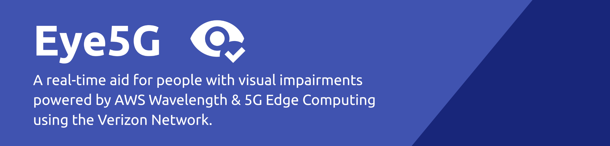
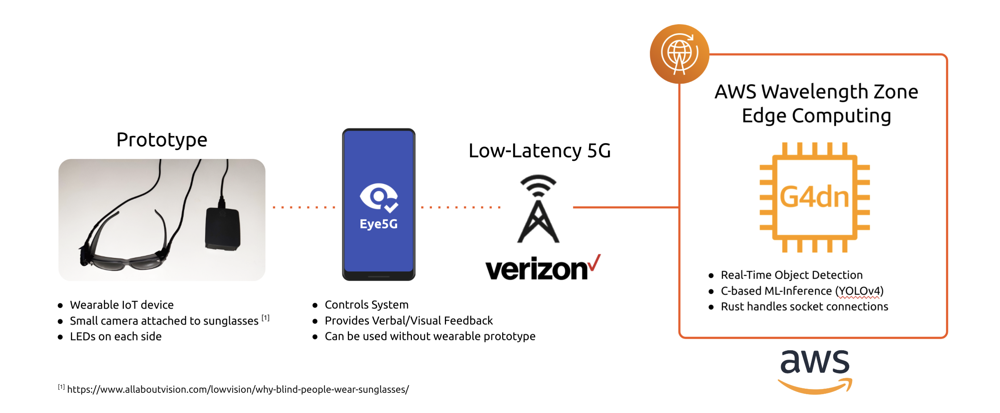
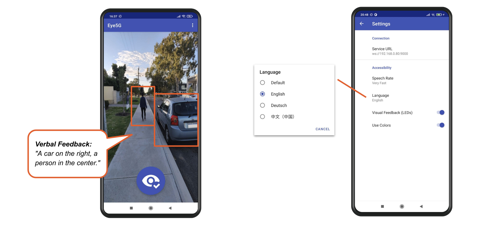

&nbsp;
&nbsp;

# Eye 5G

Eye5G is an experimental aid for people with visual impairments featuring low-latency, real-time object detection using 5G Edge Computing.
This repository represents our submission for the [5G Edge Computing Challenge with AWS and Verizon](https://5gedgecloud.devpost.com/).

## Inspiration

An estimated 100 million people worldwide have moderate or severe distance vision impairment or blindness [[1]](https://www.who.int/news/item/27-05-2021-global-eye-care-targets-endorsed-by-member-states-at-the-74th-world-health-assembly). It is important to understand that blindness is a spectrum and each person's experience is unique. Visual impairments include blurry vision, tunnel vision, difficulties with depth perception or object detection, etc. Some people are left with only light perception or are completely blind.

We have decided to investigate potential solutions to alleviate symptoms of vision impairment and to develop a system that will be submitted to the aforementioned challenge.

## What it does

In consultation with a doctor, we have created a system that is able to detect 80 different everyday objects (indoors & outdoors) in real-time and announce them verbally. Eventually, through a prototype wearable IoT device, visual feedback can be given in the form of light flashes. The following points should be addressed:

The system should...

* ...be able to detect a range of objects
* ...be customizable to address varying needs
* ...provide real-time feedback, verbal and visual
* ...be simple & convenient to use

This lead to the architectural overview below:

The optional prototype smart-glasses with camera and LED attachments are intended to be controlled by an Android app. The app forwards a video stream over 5G using the Verizon network to an EC2 G4dn instance sitting in an AWS Wavelength zone. The EC2 instance performs real-time object detection and sends the results back to the phone which then announces the objects to the user verbally.

For our use case, AWS Wavelength is perfect to offload processing to reduce battery usage on the devices and to be able to deploy a powerful and accurate ML model with high performance.

## How we built it

### Back-End ML Inference

The back-end of the system is designed to run inside of an AWS Wavelength Zone on an EC2 G4 instance optimized for Machine Learning. Incoming connections are handled by a Websocket server written in Rust that decodes received frames and forwards them to the ML model. For object detection, we have incorperated the excellent C-based [Darknet & YOLOv4](https://github.com/AlexeyAB/darknet).

By utilizing the GPUs available on EC2 G4 instances, we are able to perform real-time object detection in ~0.05 seconds per frame.

### Android App

The user-facing part of the system is an Android app that accesses the camera and forwards the video feed to the back-end server for real-time object detection. Frames are properly resized and compressed to decrease bandwidth requirements.

Detected objects returned by the server are then prioritized and grouped. For example, a car is more important and potentially more dangerous to the user than a person. Such objects are announced first and will eventually affect the blink-rate/colors of the LEDs when using the wearable IoT device. When scanning the scene illustrated below, the phone will verbally inform the user: "A car on the right, a person in the center."

To address the needs of people with various different types and degrees of visual impairment, the app features accessibility settings such as varying the speech rate (how fast object announcements are spoken), what language to use (currently, English, German, and Chinese are supported), as well as settings related to the visual feedback that will be used once integration with the wearable device is established.

## Challenges we ran into

### Video Encoding

As we examined a few different approaches to streaming video, including RTSP, we discovered that available implementations were buffering frames to reduce lag/stutter. Unfortunately, this generally resulted in a delay of about two seconds (depending on buffer size), which is slow long for our use case. Reducing the buffer size would inevitably result in noticable compression artefacts that negatively affected the object detection. We eventually decided to resize and compress frames manually and were able to achieve great results.

### Testing

One of the main challenges we ran into was testing the system. AWS Wavelength is currently only available in select cities in the United States and can only be accessed through the Verizon Network. As we are based in Perth, Australia, we are far way from the AWS Wavelength Zones and thus experienced high latency. Access to the Nova Testing Platform kindly provided by Verizon for the duration of this challenge was helpful and allowed us to test the Android app in a 5G environment that is able to access AWS Wavelength.

For general testing during development, we mainly resorted to using a Local Area Network environment and deployed onto a test system running on a standard AWS EC2 instance in the Asia Pacific region. This turned out to be a good compromise because once the system is running properly in a regular AWS region, it can easily be deployed into an AWS Wavelength zone.

## Accomplishments that we're proud of

We are excited that we managed to get accurate real-time object detection working reliably and that we are able to announce objects using text-to-speech in different languages tailored for different needs. We hope that this app can be useful for people that suffer visual impairment.

## What we learned

During the course of this project, we had the chance to try out various things that were new to us:

1) We got to know AWS Wavelength and 5G teachnology, giving us access to ultra-low-latency connections and high bandwidth.

2) Real-time object detection using Machine Learning on GPU-enabled EC2 G4 instances.

3) A deep-dive into video capture and encoding on Android.

## What's next for Eye5G

We are aiming to further improve verbal object announcements and make them even smarter. Currently, objects are sorted by priority and grouped into their rough location. While this works well, it can be rather chatty. Implementing object persistence (keeping track of objects accross multiple frames as they move) would allow us to reduce noise and make announcements clearer.

Also, we would like to improve and properly integrate the wearable IoT device with the app so that they can communicate with each other.

